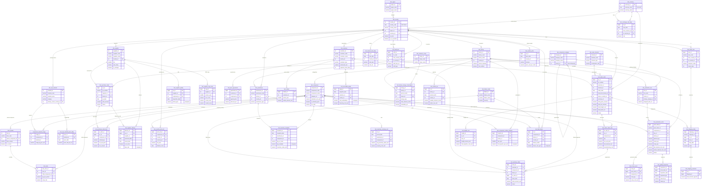

# EV Parts Lakehouse — ER 图 (Mermaid)

> 为清晰起见，省略了部分字段，只保留主键、外键和关键业务字段。

```mermaid
erDiagram

    %% ======================== 地理 / 货币 ========================
    dim_region {
        int region_id PK
        varchar region_code
        varchar region_name
    }
    dim_currency {
        int currency_id PK
        char currency_code "ISO 4217"
        varchar currency_name
    }
    dim_country {
        int country_id PK
        char country_code "ISO 3166-1"
        varchar country_name
        int region_id FK
        int currency_id FK
        numeric vat_rate
        boolean is_eu_member
    }
    dim_region ||--o{ dim_country : "contains"
    dim_currency ||--o{ dim_country : "local currency"

    %% ======================== 产品 / BOM ========================
    dim_component_category {
        int category_id PK
        varchar category_code
        varchar category_name
        int parent_id FK "self-ref hierarchy"
    }
    dim_component {
        int component_id PK
        varchar component_code
        varchar component_name
        int category_id FK
        numeric standard_cost_usd
        boolean is_finished_good
        varchar hs_code
    }
    bom_header {
        int bom_id PK
        varchar bom_code
        int parent_component_id FK
        varchar bom_version
        boolean is_current
    }
    bom_item {
        int bom_item_id PK
        int bom_id FK
        int child_component_id FK
        numeric qty_per_parent
        numeric scrap_rate
    }
    dim_raw_material {
        int material_id PK
        varchar material_code
        varchar material_name
        varchar category
        int primary_source_country_id FK
    }
    component_material_usage {
        int usage_id PK
        int component_id FK
        int material_id FK
        numeric usage_kg_per_unit
    }
    fact_raw_material_price_daily {
        bigint price_id PK
        int material_id FK
        date price_date
        numeric price_usd_per_mt
    }

    dim_component_category ||--o{ dim_component_category : "parent/child"
    dim_component_category ||--o{ dim_component : "categorizes"
    dim_component ||--o{ bom_header : "parent component"
    bom_header ||--o{ bom_item : "contains"
    dim_component ||--o{ bom_item : "child component"
    dim_raw_material ||--o{ component_material_usage : "used in"
    dim_component ||--o{ component_material_usage : "consumes"
    dim_raw_material ||--o{ fact_raw_material_price_daily : "priced daily"
    dim_country ||--o{ dim_raw_material : "primary source"

    %% ======================== 工厂 / 生产 ========================
    dim_factory {
        int factory_id PK
        varchar factory_code
        varchar factory_name
        int country_id FK
        numeric annual_capacity
        boolean iatf_certified
    }
    dim_production_line {
        int line_id PK
        varchar line_code
        int factory_id FK
        int primary_category_id FK
        numeric designed_takt_sec
    }
    fact_production_order {
        bigint prod_order_id PK
        varchar prod_order_no
        int component_id FK
        int line_id FK
        int factory_id FK
        numeric planned_qty
        numeric actual_qty
        numeric scrap_qty
        numeric std_material_cost_usd
        numeric actual_material_cost_usd
        varchar status
    }
    fact_quality_inspection {
        bigint inspection_id PK
        bigint prod_order_id FK
        date inspection_date
        numeric inspected_qty
        numeric passed_qty
        numeric failed_qty
    }
    fact_scrap_event {
        bigint scrap_id PK
        bigint prod_order_id FK
        int component_id FK
        numeric scrap_qty
        numeric scrap_cost_usd
    }

    dim_country ||--o{ dim_factory : "located in"
    dim_factory ||--o{ dim_production_line : "has lines"
    dim_component_category ||--o{ dim_production_line : "primary category"
    dim_component ||--o{ fact_production_order : "produced"
    dim_production_line ||--o{ fact_production_order : "on line"
    dim_factory ||--o{ fact_production_order : "at factory"
    fact_production_order ||--o{ fact_quality_inspection : "inspected"
    fact_production_order ||--o{ fact_scrap_event : "generates scrap"

    %% ======================== 供应商 / 采购 ========================
    dim_supplier {
        int supplier_id PK
        varchar supplier_code
        varchar supplier_name
        int country_id FK
        smallint tier
        varchar risk_rating
        boolean is_strategic
    }
    fact_purchase_order {
        bigint po_id PK
        varchar po_number
        int supplier_id FK
        int factory_id FK
        date po_date
        numeric total_amount
        varchar status
    }
    fact_purchase_order_item {
        bigint po_item_id PK
        bigint po_id FK
        int component_id FK
        numeric ordered_qty
        numeric net_unit_price
        numeric line_amount
    }
    fact_supplier_delivery {
        bigint delivery_id PK
        bigint po_id FK
        int supplier_id FK
        date promised_date
        date actual_date
        boolean is_on_time
        int days_late "computed"
    }
    fact_supplier_quality {
        bigint sq_id PK
        int supplier_id FK
        int component_id FK
        date inspection_date
        numeric defect_ppm "computed"
    }
    fact_supplier_esg_score {
        bigint esg_id PK
        int supplier_id FK
        smallint assess_year
        numeric env_score
        numeric social_score
        numeric overall_score
    }

    dim_country ||--o{ dim_supplier : "based in"
    dim_supplier ||--o{ fact_purchase_order : "receives PO"
    dim_factory ||--o{ fact_purchase_order : "delivers to"
    fact_purchase_order ||--o{ fact_purchase_order_item : "line items"
    dim_component ||--o{ fact_purchase_order_item : "procured"
    fact_purchase_order ||--o{ fact_supplier_delivery : "delivery record"
    dim_supplier ||--o{ fact_supplier_delivery : "delivers"
    dim_supplier ||--o{ fact_supplier_quality : "IQC"
    dim_supplier ||--o{ fact_supplier_esg_score : "ESG rated"

    %% ======================== 客户 / 销售 ========================
    dim_customer {
        int customer_id PK
        varchar customer_code
        varchar customer_name
        int country_id FK
        varchar customer_type
        numeric credit_limit_usd
        int payment_terms_days
    }
    dim_sales_channel {
        int channel_id PK
        varchar channel_code
        varchar channel_type
        numeric commission_rate
    }
    fact_country_price_list {
        bigint price_list_id PK
        int component_id FK
        int country_id FK
        int currency_id FK
        numeric list_price
        date effective_from
    }
    fact_price_agreement {
        bigint agreement_id PK
        int customer_id FK
        int component_id FK
        numeric agreed_price
        numeric discount_pct
    }
    fact_sales_order {
        bigint so_id PK
        varchar so_number
        int customer_id FK
        int channel_id FK
        date order_date
        int ship_from_factory_id FK
        int ship_to_country_id FK
        int currency_id FK
        numeric total_gross_revenue
        numeric total_net_revenue
        numeric total_freight_cost
        numeric total_tariff_cost
        varchar status
    }
    fact_sales_order_item {
        bigint so_item_id PK
        bigint so_id FK
        int component_id FK
        numeric qty
        numeric net_unit_price
        numeric std_material_cost
        numeric manufacturing_cost
    }
    fact_rebate {
        bigint rebate_id PK
        int customer_id FK
        smallint period_year
        numeric rebate_amount_usd
    }

    dim_country ||--o{ dim_customer : "domiciled in"
    dim_customer ||--o{ fact_sales_order : "places SO"
    dim_sales_channel ||--o{ fact_sales_order : "via channel"
    dim_factory ||--o{ fact_sales_order : "ships from"
    dim_country ||--o{ fact_sales_order : "ships to"
    dim_currency ||--o{ fact_sales_order : "invoiced in"
    fact_sales_order ||--o{ fact_sales_order_item : "line items"
    dim_component ||--o{ fact_sales_order_item : "sold component"
    dim_component ||--o{ fact_country_price_list : "priced by country"
    dim_country ||--o{ fact_country_price_list : "country price"
    dim_customer ||--o{ fact_price_agreement : "special price"
    dim_customer ||--o{ fact_rebate : "earns rebate"

    %% ======================== 库存 ========================
    dim_warehouse {
        int warehouse_id PK
        varchar warehouse_code
        int factory_id FK
        int country_id FK
        varchar warehouse_type
    }
    fact_inventory_snapshot {
        bigint snapshot_id PK
        date snapshot_date
        int warehouse_id FK
        int component_id FK
        numeric qty_on_hand
        numeric qty_available "computed"
        numeric inventory_value_usd
    }
    fact_inventory_carrying_cost {
        bigint icc_id PK
        date period_date
        int warehouse_id FK
        int component_id FK
        numeric avg_inventory_value_usd
        numeric carrying_cost_usd
    }

    dim_factory ||--o{ dim_warehouse : "holds"
    dim_country ||--o{ dim_warehouse : "located in"
    dim_warehouse ||--o{ fact_inventory_snapshot : "snapshot"
    dim_component ||--o{ fact_inventory_snapshot : "stocked"
    dim_warehouse ||--o{ fact_inventory_carrying_cost : "cost"

    %% ======================== 财务 ========================
    fact_exchange_rate_daily {
        bigint fx_id PK
        date rate_date
        int from_currency_id FK
        int to_currency_id FK
        numeric rate
    }
    fact_interest_rate_daily {
        bigint ir_id PK
        date rate_date
        int country_id FK
        varchar rate_type
        numeric rate_pct
    }
    fact_receivable_aging {
        bigint aging_id PK
        date snapshot_date
        int customer_id FK
        int country_id FK
        numeric total_outstanding "computed"
        numeric financing_cost_usd
    }

    dim_currency ||--o{ fact_exchange_rate_daily : "from"
    dim_currency ||--o{ fact_exchange_rate_daily : "to"
    dim_country ||--o{ fact_interest_rate_daily : "rate in"
    dim_customer ||--o{ fact_receivable_aging : "AR aging"

    %% ======================== 物流 / 关税 ========================
    fact_tariff_rate {
        bigint tariff_id PK
        varchar hs_code
        int from_country_id FK
        int to_country_id FK
        numeric tariff_rate_pct
        varchar tariff_type
    }
    fact_trade_lane {
        bigint lane_id PK
        varchar lane_code
        int from_country_id FK
        int to_country_id FK
        varchar transport_mode
        int transit_days
    }
    fact_shipping_order {
        bigint shipping_id PK
        varchar shipping_no
        bigint so_id FK
        bigint lane_id FK
        date ship_date
        varchar status
    }
    fact_freight_cost {
        bigint freight_id PK
        bigint so_id FK
        bigint lane_id FK
        numeric freight_amount_usd
        numeric total_logistics_cost_usd
    }

    dim_country ||--o{ fact_tariff_rate : "from country"
    dim_country ||--o{ fact_tariff_rate : "to country"
    dim_country ||--o{ fact_trade_lane : "from"
    dim_country ||--o{ fact_trade_lane : "to"
    fact_sales_order ||--o{ fact_shipping_order : "shipped via"
    fact_trade_lane ||--o{ fact_shipping_order : "uses lane"
    fact_sales_order ||--o{ fact_freight_cost : "freight cost"

    %% ======================== ESG / 碳 ========================
    dim_emission_scope {
        int scope_id PK
        varchar scope_code
        varchar scope_name
    }
    fact_factory_energy_consumption {
        bigint energy_id PK
        int factory_id FK
        date period_month
        int scope_id FK
        varchar energy_type
        numeric total_emission_tco2e
        numeric renewable_pct
    }
    fact_component_carbon_footprint {
        bigint footprint_id PK
        int component_id FK
        int factory_id FK
        smallint calc_year
        numeric total_kgco2e_per_unit "computed"
    }
    fact_carbon_price {
        bigint cp_id PK
        date price_date
        int country_id FK
        varchar scheme
        numeric price_usd_per_tco2e
    }
    fact_carbon_tax {
        bigint ct_id PK
        int factory_id FK
        date period_month
        int country_id FK
        numeric taxable_emission_tco2e
        numeric carbon_tax_usd
    }
    fact_shipping_emission {
        bigint se_id PK
        bigint shipping_id FK
        numeric total_emission_kgco2e
    }

    dim_factory ||--o{ fact_factory_energy_consumption : "energy use"
    dim_emission_scope ||--o{ fact_factory_energy_consumption : "scope"
    dim_component ||--o{ fact_component_carbon_footprint : "PCF"
    dim_factory ||--o{ fact_component_carbon_footprint : "produced at"
    dim_country ||--o{ fact_carbon_price : "carbon market"
    dim_factory ||--o{ fact_carbon_tax : "pays tax"
    fact_shipping_order ||--o{ fact_shipping_emission : "emission"

    %% ======================== 售后 ========================
    dim_failure_mode {
        int failure_id PK
        varchar failure_code
        varchar failure_name
        varchar severity
    }
    fact_warranty_claim {
        bigint claim_id PK
        int customer_id FK
        int component_id FK
        int failure_id FK
        bigint so_item_id FK
        date claim_date
        numeric claim_amount_usd
        varchar status
    }
    fact_field_failure {
        bigint ff_id PK
        int component_id FK
        int failure_id FK
        int country_id FK
        date failure_month
        numeric failure_rate_ppm "computed"
    }

    dim_failure_mode ||--o{ fact_warranty_claim : "failure type"
    dim_customer ||--o{ fact_warranty_claim : "customer claim"
    dim_component ||--o{ fact_warranty_claim : "failed component"
    fact_sales_order_item ||--o{ fact_warranty_claim : "original sale"
    dim_component ||--o{ fact_field_failure : "field failure"
    dim_failure_mode ||--o{ fact_field_failure : "mode"
    dim_country ||--o{ fact_field_failure : "in country"
```
